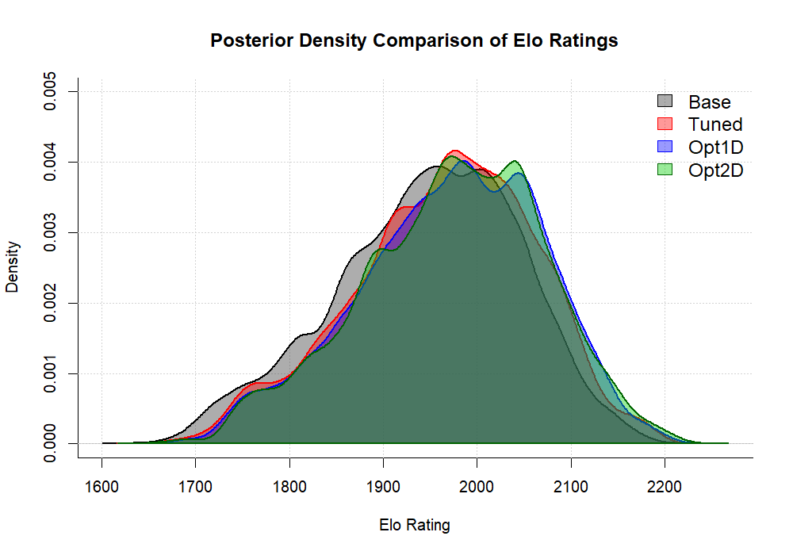

# Task 8: Final Tournament & Bayesian Analysis
### VU 105.173 Bayesian Statistics - Final Project

## 1. Objective
The goal of this task was to evaluate the performance of four chess engine configurations using a Round-Robin tournament and Bayesian statistical analysis.

## 2. Methodology
We simulated a tournament and used Markov Chain Monte Carlo (MCMC) to estimate the posterior distribution of the Elo ratings.

### Tournament Settings
* **Engines:** Base, Tuned, Opt1D, Opt2D
* **Rounds:** 50 (Total 600 games)
* **Time Control:** 10 seconds + 0.1s increment
* **Opening Book:** Randomly selected positions

### Statistical Analysis
* **Method:** Metropolis-Hastings MCMC Sampler
* **Iterations:** 30,000
* **Burn-in:** 5,000
* **Likelihood:** Logistic Elo model

## 3. Results (Elo Ratings)
Based on the MCMC analysis, the **Opt2D** engine was identified as the strongest configuration.

| Engine | Mean Elo Rating |
| :--- | :--- |
| **Opt2D** | **1973.8** |
| **Opt1D** | 1971.6 |
| **Tuned** | 1964.1 |
| **Base** | 1946.4 |

## 4. Visualization
The density plot below illustrates the posterior distributions of the Elo ratings for each engine. It clearly shows the improvement of the optimized versions over the Base engine.

## 5. Files in this Repository
* `task8_mcmc.R`: The full R script used to run the tournament and MCMC analysis.
* `task8_final_full.pgn`: The PGN file containing the moves of all 600 games played.
* `Task8_Final_Elo_Ratings_Full.txt`: The raw output file with summary statistics and final Elo values.
* `Task8_Comparison_Plot.png`: The visualization of the posterior densities.
